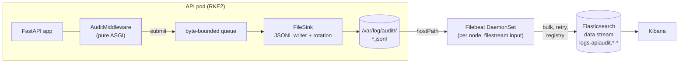
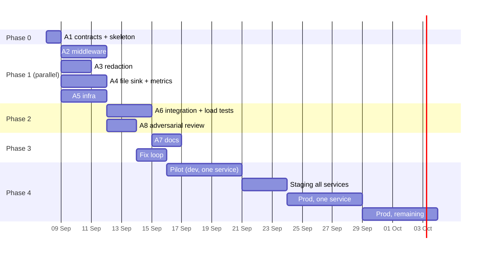

# Execution Plan — API Request Audit Logging

| | |
|---|---|
| Status | Draft |
| Author | B |
| Last updated | 2026-09-05 |
| Companion | `SPEC-request-audit-logging.md` (v1, see §2 for what this plan supersedes) |
| Build method | Coding agents (e.g. Claude Code) working in parallel on contract-isolated modules, with B as orchestrator and reviewer |

---

## 0. How to use this document

Read §1–§4 once. Then work through §7 phase by phase: each phase has an entry
gate, a set of agents that can run in parallel, and an exit gate. Each agent in
§8 has a copy-pasteable brief. §6 defines the contracts that let agents work
without seeing each other's code — **do not let any agent change a contract
without going back through the orchestrator.**

---

## 1. Decisions locked

| # | Decision | Rationale |
|---|---|---|
| D-1 | **Pure ASGI middleware**, never `BaseHTTPMiddleware` | Body replay only works at the raw ASGI layer (spec §5.1) |
| D-2 | **No sampling.** Every non-excluded request is logged | User requirement: nothing dropped |
| D-3 | **Request bodies captured; response bodies not** | Confirmed scope. Response bodies ~3× storage and the main PII leak vector |
| D-4 | **Body cap 1 MB**, truncation flagged, never unbounded | Unbounded = OOM vector in the API process and bulk-request failures. 1 MB makes truncation rare enough to be a signal |
| D-5 | **Multipart / file uploads: metadata only**, bytes skipped | Blobs belong in object storage, not Elasticsearch |
| D-6 | **Transport: `FileSink` → JSONL on a volume → Filebeat → Elasticsearch** | Durable across ES outages and pod restarts. No Kafka, no consumer service to build |
| D-7 | **File, not stdout** | stdout writes can block the process when the runtime pipe fills; kubelet log rotation (10 MB default) loses lines under volume |
| D-8 | **Package owns file rotation** | Size-based, `file_max_bytes` × `file_backup_count`. Filebeat reads rotated files until they are deleted |
| D-9 | **Byte-bounded in-memory queue**, not document-bounded | Fixes spec R-4 (640 MB theoretical ceiling) |
| D-10 | **Full raw body stored unindexed** + `flattened` copy for search | Full fidelity in `body_raw`; `flattened` bounds the mapping (spec §8.3) |
| D-11 | **`dynamic: false` on the index template, installed before first write** | Spec G-5, R-1 |
| D-12 | **Header capture by allowlist; body-key redaction by denylist**, denylist additive-only | Spec FR-11…FR-14 |
| D-13 | **Package never talks to Elasticsearch** | Filebeat does. Package has zero ES client dependency |

## 2. What this plan supersedes in SPEC v1

| Spec item | Change |
|---|---|
| FR-16, FR-17 | **Deleted.** No sampling. `exclude_paths` remains |
| FR-08 | `max_body_bytes` default `65536` → `1_048_576` |
| FR-18 | `queue_max` (documents) → `queue_max_bytes` (default 64 MB) |
| FR-19 | Drop only when `queue_max_bytes` is exceeded — with a file sink this means "disk is not keeping up", which is a paging event, not a normal condition |
| FR-20, FR-21 | Replaced: no bulk to ES. `FileSink` flushes to disk every `flush_interval_seconds` (default 1 s) or when the queue passes `flush_max_bytes`. Retry logic moves to Filebeat |
| §7.1, OQ-1 | **Closed.** Transport is D-6 |
| §8.2 | Documents gain a `data_stream.*` block so Filebeat can route them (§6.2) |
| §13 | Re-estimated for parallel agent execution (§9) |
| R-4 | Resolved by D-9 |
| R-6 | Retired (transport decided) |

The spec should be revised to match once this plan is approved. Until then,
**this document wins on any conflict.**

## 3. Assumptions — confirm or correct

| # | Assumption | Impact if wrong |
|---|---|---|
| A-1 | Peak load is **unknown**. Sizing in §5 is given for 10 / 50 / 200 rps. **B to supply the real number.** | Retention, ILM tiering, and node disk for the Filebeat buffer all scale from it |
| A-2 | Target Elasticsearch is 8.x (data streams, `flattened`, ILM available) | 7.x needs template syntax changes; <7.3 has no `flattened` |
| A-3 | Filebeat 8.x is deployable as a DaemonSet in RKE2 and air-gapped image import is possible | If not, fall back to a sidecar per pod (§4.3) |
| A-4 | Kibana exists in the target environments | If not, Agent 5's dashboard task is dropped |
| A-5 | Services run one FastAPI process per pod (uvicorn, possibly multiple workers) | Multiple workers ⇒ one log file per worker PID, handled by `FileSink` naming |
| A-6 | Python ≥ 3.11, Starlette ≥ 0.37, FastAPI ≥ 0.110 | Route-in-scope behaviour is version-sensitive (spec R-7) |

---

## 4. Target architecture



### 4.1 Request path (hot, must stay < 5 ms overhead)

1. `AuditMiddleware.__call__(scope, receive, send)`
2. Exclusion check on raw path → pass through untouched if excluded
3. Resolve/generate `trace.id`, start monotonic clock
4. Wrap `receive`: record chunks up to `max_body_bytes`, pass every message through unchanged
5. Wrap `send`: capture `status`, response headers, accumulate `bytes`; detect final chunk
6. `await app(scope, receive_w, send_w)` inside `try/except`
7. After completion: read `scope["route"]`, `scope["path_params"]`; call `user_resolver(scope)`
8. `build_document(ctx)` → `redact(...)` → `sink.submit(doc)` — **enqueue only**, returns immediately
9. Any exception in steps 3–8 that is *ours* → count, log once at WARN, swallow

### 4.2 Sink path (background, off the request)

- A single `asyncio.Task` per process drains the queue every `flush_interval_seconds`
- Writes with `os.write` of joined JSONL bytes; `fsync` policy configurable (default: no fsync — Filebeat tolerates a few lost lines on power loss better than the API tolerates fsync latency)
- Rotates when the active file passes `file_max_bytes`; deletes beyond `file_backup_count`
- On shutdown (`lifespan` end / SIGTERM): drain and close within `shutdown_flush_timeout`

### 4.3 Shipping

**Default — DaemonSet:** one Filebeat per node, `hostPath: /var/log/audit`
mounted read-only, `filestream` input on `/var/log/audit/*/*.jsonl`. Pods
mount the same `hostPath` read-write under a per-pod subdirectory
(`$POD_NAME`). Fewer Filebeat instances, one config to manage.

**Alternative — sidecar:** Filebeat container in each pod sharing an
`emptyDir`. No hostPath permissions to negotiate; N× Filebeat instances.
Choose this if hostPath is blocked by cluster policy.

Filebeat routes on fields the package emits:
`index: "%{[data_stream.type]}-%{[data_stream.dataset]}-%{[data_stream.namespace]}"`.

---

## 5. Sizing (until A-1 is answered)

Per document, measured estimate: ~2 KB JSON at rest in the file, ~0.6 KB on
ES disk with `best_compression`, one replica ⇒ ~1.2 KB effective.

| Peak rps | JSONL written/day | ES disk/day (1 replica) | ES disk @ 90 d | Node buffer for 6 h ES outage |
|---|---|---|---|---|
| 10 | 1.7 GB | 1.0 GB | 93 GB | 0.4 GB |
| 50 | 8.6 GB | 5.2 GB | 465 GB | 2.2 GB |
| 200 | 34.6 GB | 20.7 GB | 1.86 TB | 8.6 GB |

At 200 rps, 90-day retention with a replica is a real cluster commitment.
Levers, in order of preference: shorter hot/warm windows and replica 0 in
cold; 60-day retention; body cap 256 KB.

Defaults for `FileSink` given this table: `file_max_bytes = 256 MB`,
`file_backup_count = 8` ⇒ 2 GB per pod ceiling. Adjust per service from the
row that matches its load.

---

## 6. Contracts (frozen after Phase 0)

Every agent builds against these. They live in `audit_logging/_contracts.py`
and `docs/schema.md` and are written by Agent 1 **before** anyone else starts.

### 6.1 Package layout

```
audit_logging/
  __init__.py          # public: AuditMiddleware, AuditConfig, Sink, FileSink, NullSink
  _contracts.py        # Sink ABC, RequestContext, Metrics protocol   [A1]
  config.py            # AuditConfig                                    [A1]
  middleware.py        # AuditMiddleware (pure ASGI)                    [A2]
  document.py          # build_document(ctx) -> dict                    [A2]
  redact.py            # redact(), filter_headers(), normalize_key()    [A3]
  sinks/
    __init__.py
    file_sink.py       # FileSink                                       [A4]
    null_sink.py       # NullSink (tests)                               [A1]
  metrics.py           # InMemoryMetrics, optional PrometheusMetrics    [A4]
infra/
  elasticsearch/
    ilm-apiaudit.json                                                   [A5]
    template-apiaudit.json                                              [A5]
    bootstrap.py       # idempotent install, air-gapped, config block at top [A5]
  filebeat/
    filebeat.yml                                                        [A5]
    daemonset.yaml                                                      [A5]
  kibana/
    dashboards.ndjson                                                   [A5]
tests/
  unit/                                                                 [A2,A3,A4 own their own]
  integration/                                                          [A6]
  load/                                                                 [A6]
docs/
  schema.md            # document field reference                       [A1]
  integration.md                                                        [A7]
  redaction.md                                                          [A7]
  runbook.md                                                            [A7]
AGENTS.md              # shared rules, §8.0                             [A1]
```

### 6.2 Document schema

As spec §8.1, **plus**:

```json
"data_stream": { "type": "logs", "dataset": "apiaudit.orders-api", "namespace": "prod" }
```

`dataset` = `apiaudit.` + `service_name` with any character outside
`[a-z0-9_.]` replaced by `_`.

Index template `index_patterns` stays `["logs-apiaudit.*-*"]`; add
`data_stream.type/dataset/namespace` as `constant_keyword` to the mapping.

### 6.3 `Sink`

```python
class Sink(ABC):
    async def start(self) -> None: ...
    def submit(self, doc: dict) -> bool: ...     # sync, non-blocking, enqueue only.
                                                 # Returns False if dropped.
    async def flush(self) -> None: ...
    async def close(self) -> None: ...           # must return within shutdown_flush_timeout
```

`submit` is deliberately **synchronous**: it is called from the request path
and must never await. Anything slower than a `deque.append` is a bug.

### 6.4 `RequestContext`

```python
@dataclass(slots=True)
class RequestContext:
    trace_id: str
    started_ns: int                 # time.monotonic_ns()
    ended_ns: int | None
    scope: dict                     # the ASGI scope, post-routing
    method: str
    raw_path: str
    query_string: bytes
    content_type: str | None
    body: bytes                     # <= max_body_bytes
    body_truncated: bool
    body_skipped: str | None        # "content_type" | "empty" | None
    status_code: int | None
    response_headers: list[tuple[bytes, bytes]]
    response_bytes: int
    outcome: str                    # "success" | "failure" | "disconnected"
    exc: BaseException | None
    user: dict | None               # from user_resolver
```

### 6.5 Redaction

```python
DEFAULT_REDACT_KEYS: frozenset[str]    # normalized forms
DEFAULT_HEADER_ALLOWLIST: frozenset[str]
REDACTED = "[REDACTED]"
TRUNCATED = "[TRUNCATED]"

def normalize_key(k: str) -> str: ...  # lower(); strip "_", "-", "."
def redact(obj: Any, keys: frozenset[str], *, depth_limit: int = 20) -> Any: ...
def filter_headers(headers: Iterable[tuple[bytes, bytes]], allowlist: frozenset[str]) -> dict[str, str]: ...
```

`redact` is pure: returns a new structure, never mutates input.

### 6.6 `AuditConfig`

```python
class AuditConfig(BaseModel):
    service_name: str
    service_version: str = "unknown"
    environment: str = "dev"
    enabled: bool = True                              # kill switch; env AUDIT_ENABLED
    log_dir: Path = Path("/var/log/audit")
    file_max_bytes: int = 256 * 1024 * 1024
    file_backup_count: int = 8
    fsync: bool = False
    max_body_bytes: int = 1_048_576
    exclude_paths: list[str] = ["/health", "/healthz", "/ready", "/metrics",
                                "/favicon.ico", "/docs", "/openapi.json"]
    extra_redact_keys: list[str] = []
    extra_header_allowlist: list[str] = []
    queue_max_bytes: int = 64 * 1024 * 1024
    flush_max_bytes: int = 4 * 1024 * 1024
    flush_interval_seconds: float = 1.0
    shutdown_flush_timeout: float = 10.0
    user_resolver: Callable[[dict], dict | None] | None = None
```

All fields readable from environment with prefix `AUDIT_`.

### 6.7 `Metrics`

```python
class Metrics(Protocol):
    def inc(self, name: str, value: int = 1) -> None: ...
    def set(self, name: str, value: float) -> None: ...
```

Names: `audit_documents_submitted_total`, `audit_documents_dropped_total`,
`audit_documents_failed_total`, `audit_middleware_errors_total`,
`audit_queue_bytes`, `audit_flush_seconds`, `audit_file_rotations_total`.

---

## 7. Phases



| Phase | Agents | Entry gate | Exit gate |
|---|---|---|---|
| **0 — Contracts** | A1 | This plan approved; A-2…A-6 confirmed | B has reviewed `_contracts.py`, `config.py`, `docs/schema.md`, `AGENTS.md`. Contracts frozen |
| **1 — Build** | A2, A3, A4, A5 in parallel | Phase 0 exit | Each agent's unit tests green; each PR reviewed by B; no contract changes |
| **2 — Integrate** | A6, A8 in parallel | All Phase 1 PRs merged | AC-1…AC-12 + new AC-13…AC-17 green against a live dev ES; A8 report triaged |
| **3 — Harden** | A7 + whichever build agents A8's findings assign | Phase 2 exit | All A8 "must-fix" closed; docs complete; tag `v0.1.0` |
| **4 — Rollout** | Humans + runbook | `v0.1.0` in internal index; bootstrap run on dev ES | Per spec §12 steps 1–6, with drop counter = 0 and field count ≤ 200 at each step |

**Parallelism rule:** an agent in Phase 1 may stub any *other* agent's module
with the contract signature. It may not import another agent's real
implementation until Phase 2.

---

## 8. Agents

### 8.0 Shared rules — put in `AGENTS.md`

```
You are working on the audit_logging package. Rules that apply to every task:

1. Read docs/schema.md and audit_logging/_contracts.py first. They are frozen.
   If your task cannot be done without changing them, STOP and report why.
   Do not edit them.
2. Own only the paths listed in your brief. Do not touch other modules; stub
   them against the contract if you need them.
3. Never import from elasticsearch, kafka, or any network client. This package
   writes files. Filebeat ships them.
4. Nothing in the request path may await on I/O, allocate unboundedly, or
   raise. Any exception in package code is caught, counted via Metrics, and
   swallowed. The user's request always completes normally.
5. Type hints everywhere. mypy --strict must pass on your files.
6. Tests live beside your module in tests/unit/. Each functional requirement
   you implement gets at least one test named test_FR_XX_*.
7. Do not add dependencies beyond: pydantic>=2, starlette (as a peer).
   Optional extras only: prometheus-client.
8. Do not write a README, changelog, or CLI. Agent 7 owns docs. There is no CLI.
9. When done, produce a short report: what you built, what you stubbed, which
   FRs/ACs are covered, what you were unsure about. Do not summarise the code.
```

---

### A1 — Contracts & skeleton

| | |
|---|---|
| Phase | 0 |
| Owns | `audit_logging/_contracts.py`, `config.py`, `sinks/null_sink.py`, `__init__.py`, `docs/schema.md`, `AGENTS.md`, `pyproject.toml`, `tests/conftest.py` |
| Inputs | This plan §6; spec §8.1 |
| Blocks | Everyone |
| Size | 1 day |

**Definition of done**
- `_contracts.py` matches §6.3, §6.4, §6.7 exactly
- `AuditConfig` matches §6.6, loads from env with `AUDIT_` prefix, validates `0 < max_body_bytes <= 16 MB`, `queue_max_bytes >= flush_max_bytes`
- `NullSink` implements `Sink` with no-op methods and a `submitted: list[dict]` attribute for tests
- `docs/schema.md` lists every field in §6.2 / spec §8.1 with type, ECS-or-custom, and which agent populates it
- `AGENTS.md` contains §8.0 verbatim
- `pyproject.toml`: package metadata, `[project.optional-dependencies] prometheus`, pytest + mypy config

**Brief**
```
Create the skeleton of the audit_logging package. Implement exactly the
contracts in the attached §6 — Sink ABC, RequestContext dataclass, Metrics
protocol, AuditConfig pydantic-settings model, NullSink — plus docs/schema.md
documenting every document field, and AGENTS.md with the shared rules. Add
pyproject.toml with pytest, mypy --strict, and an optional prometheus extra.
Do not implement middleware, redaction, or FileSink; create the module files
with a docstring and `raise NotImplementedError` bodies so imports work.
Write tests only for AuditConfig validation and env loading.
```

---

### A2 — Middleware & document builder

| | |
|---|---|
| Phase | 1 |
| Owns | `middleware.py`, `document.py`, `tests/unit/test_middleware.py`, `tests/unit/test_document.py` |
| Inputs | Contracts; spec §5.1, FR-01…FR-09, FR-23…FR-25, §10 |
| Depends on | A1. Stubs `redact()` as identity and `Sink` as `NullSink` |
| Size | 3 days |

**Definition of done**
- Pure ASGI: `__call__(self, scope, receive, send)`. **No `BaseHTTPMiddleware` anywhere.** Non-`http` scopes (lifespan, websocket) pass through untouched
- `receive` wrapper buffers up to `max_body_bytes`, sets `body_truncated`, and passes every message through byte-identical
- `send` wrapper captures status/headers on `http.response.start`, accumulates bytes, marks `ended_ns` on the message with `more_body: False`
- Adds `X-Request-ID` to response headers (FR-24) inside the `send` wrapper — the only mutation the middleware makes
- Route from `scope.get("route")` → `.path`; `"unmatched"` if absent
- App exception: build doc with `status_code=500`, `outcome="failure"`, `exc` set; **re-raise unchanged**
- Client disconnect (`http.disconnect` before response) → `outcome="disconnected"`
- `build_document(ctx)` produces the §6.2 document, calls `redact()` and `filter_headers()` (stubbed), handles non-object JSON per spec §10
- Every package-internal error → `metrics.inc("audit_middleware_errors_total")`, WARN log once per process, swallowed
- Tests cover FR-01…FR-09, FR-23…FR-25 using `httpx.ASGITransport`, including: body echo, streaming response, 404, raising endpoint, disconnect, multipart, oversized body, non-JSON body

**Brief**
```
Implement AuditMiddleware in middleware.py as pure ASGI middleware (never
BaseHTTPMiddleware) and build_document in document.py, against the frozen
contracts. Wrap receive to buffer and replay the request body up to
config.max_body_bytes; wrap send to capture status, headers, byte count and
completion. Read the matched route from scope after the app returns. On app
exception, emit a 500 document and re-raise. Implement FR-01 to FR-09 and
FR-23 to FR-25 from the spec. Treat redact() and filter_headers() as identity
stubs and use NullSink. Every internal error must be caught, counted, and
swallowed. Write tests with httpx.ASGITransport covering each FR and the edge
cases in spec §10. Report measured overhead of one request through the
middleware vs without, in microseconds.
```

---

### A3 — Redaction

| | |
|---|---|
| Phase | 1 |
| Owns | `redact.py`, `tests/unit/test_redact.py` |
| Inputs | Contracts §6.5; spec FR-10…FR-14 |
| Depends on | A1 |
| Size | 2 days |

**Definition of done**
- `normalize_key`, `redact`, `filter_headers` per §6.5, pure functions
- Default denylist and header allowlist as spec FR-11/FR-12 constants
- Recursive over dicts and lists; depth-capped, deeper subtrees → `"[TRUNCATED]"`
- Keys preserved, values → `"[REDACTED]"`
- Handles cycles without infinite recursion (via depth cap, not id-tracking — simpler and sufficient)
- Property-based tests (hypothesis): output never contains a value under a denylisted key at any depth; output structure keys equal input structure keys
- Benchmark: 1 MB nested JSON redacted in < 20 ms

**Brief**
```
Implement redact.py per contract §6.5: normalize_key (lowercase, strip _ - .),
redact (recursive, pure, depth-capped at 20 with "[TRUNCATED]" for deeper
subtrees, replaces values under denylisted normalized keys with "[REDACTED]"
while preserving keys), and filter_headers (allowlist only, dropped headers
vanish entirely). Include DEFAULT_REDACT_KEYS and DEFAULT_HEADER_ALLOWLIST
from spec FR-11/FR-12. Write hypothesis property tests proving no denylisted
value survives at any depth, plus explicit tests for "Pass-Word",
"api-key", "API.KEY", nested arrays of objects, and self-referential input.
Benchmark 1 MB of nested JSON; target < 20 ms.
```

---

### A4 — FileSink & metrics

| | |
|---|---|
| Phase | 1 |
| Owns | `sinks/file_sink.py`, `metrics.py`, `tests/unit/test_file_sink.py`, `tests/unit/test_metrics.py` |
| Inputs | Contracts §6.3, §6.7; §4.2; revised FR-18…FR-22 (§2) |
| Depends on | A1 |
| Size | 3 days |

**Definition of done**
- `submit()` is sync: serialises to one JSON line (`orjson` if present, else stdlib with `separators=(",",":")`), appends to a `deque`, tracks total bytes. If `queue_bytes + len(line) > queue_max_bytes` → drop, `inc(dropped)`, return `False`. Never blocks
- Background task flushes on `flush_interval_seconds` or when queue passes `flush_max_bytes`; writes joined bytes with a single `os.write`; optional `fsync`
- File naming: `{log_dir}/{service_name}-{pid}.jsonl`; multiple uvicorn workers get separate files (A-5)
- Rotation at `file_max_bytes` → rename to `.1` … `.N`, delete beyond `file_backup_count`; `inc(rotations)`
- Write failure (disk full, permission): count `failed`, keep the batch for one retry on the next tick, then drop and count. Log once at ERROR per distinct error type
- `close()` drains within `shutdown_flush_timeout`, returns regardless
- `InMemoryMetrics` (dict-backed) default; `PrometheusMetrics` behind the extra, names per §6.7
- Tests: byte-bound drop, rotation boundary, concurrent submit from many tasks, close-with-timeout, disk-full simulation via a tmp path made read-only, one file per PID

**Brief**
```
Implement FileSink in sinks/file_sink.py per contract §6.3 and plan §4.2: a
synchronous non-blocking submit() that serialises to one JSON line and
enqueues into a byte-bounded deque (drop + count when full), a background
asyncio task that flushes to a JSONL file on interval or size, size-based
rotation with backup count, optional fsync, and close() bounded by
shutdown_flush_timeout. One file per process PID. Implement metrics.py with
InMemoryMetrics and an optional PrometheusMetrics using the names in §6.7.
No network I/O of any kind. Test the drop path, rotation, concurrency,
shutdown timeout, and write failures.
```

---

### A5 — Infrastructure

| | |
|---|---|
| Phase | 1 |
| Owns | `infra/**` |
| Inputs | Spec §8.2, §8.4; plan §4.3, §6.2 |
| Depends on | A1 (for `docs/schema.md`) |
| Size | 3 days |

**Definition of done**
- `template-apiaudit.json`: spec §8.2 plus `data_stream.*` constant_keywords; `dynamic: false`; `total_fields.limit: 200`
- `ilm-apiaudit.json`: hot rollover 50 GB / 7 d → warm 7 d (forcemerge, replicas 1) → cold 30 d (replicas 0 if cold nodes exist, else skip) → delete 90 d. Retention as a single variable at the top
- `bootstrap.py`: **config block at the top, no CLI args.** Idempotent — PUTs ILM policy and component/index template, creates the data stream if absent, verifies by GET and prints a diff. Works with only `requests` against an ES URL + credentials from the config block. Refuses to run if `dynamic` is not `false` in the template it is about to install
- `filebeat.yml`: `filestream` input on `/var/log/audit/*/*.jsonl`, `parsers: [ndjson]`, `json.keys_under_root`, `output.elasticsearch.index` routed from `data_stream.*` fields, `setup.template.enabled: false`, `setup.ilm.enabled: false` (we own both), `queue.disk` enabled for extra durability
- `daemonset.yaml`: Filebeat DaemonSet, `hostPath /var/log/audit` read-only, registry on hostPath so it survives Filebeat restarts, resource limits, a `Secret` reference for ES credentials, and a commented sidecar variant
- `dashboards.ndjson`: data view `logs-apiaudit.*-*`; dashboard 1 "Errors by route" (status ≥ 400, terms on `audit.route`); dashboard 2 "Latency by route" (p50/p95/p99 of `event.duration` by `audit.route`); dashboard 3 "Pipeline health" (docs/min by `service.name`, `audit.request.body_truncated` count)
- A `infra/README.md` stub with the exact air-gapped procedure: image import, apply order, verification commands

**Brief**
```
Build infra/. Elasticsearch: index template per spec §8.2 plus data_stream
constant_keywords, dynamic:false, total_fields.limit 200; ILM policy per spec
§8.4 with retention as one variable; bootstrap.py as a minimal Python script
with a config block at the top and no CLI args, idempotent, that installs both
and verifies. Filebeat: filebeat.yml with a filestream/ndjson input on
/var/log/audit/*/*.jsonl routing to the data stream from document fields,
template and ILM setup disabled, disk queue enabled; a Kubernetes DaemonSet
manifest with read-only hostPath and a persisted registry, plus a commented
sidecar alternative. Kibana: exported data view and three dashboards (errors
by route, latency by route, pipeline health). Everything must work with no
internet access at apply time.
```

---

### A6 — Integration & load tests

| | |
|---|---|
| Phase | 2 |
| Owns | `tests/integration/**`, `tests/load/**`, `tests/AC-matrix.md` |
| Inputs | Spec §11 + new AC-13…AC-17 (below); all Phase 1 outputs |
| Depends on | A2, A3, A4, A5 merged |
| Size | 3 days |

**New acceptance criteria to add (closing the spec gap):**

```
AC-13 (FR-06)  Given a StreamingResponse yielding 5 chunks 100 ms apart
               When it completes
               Then event.duration is ≥ 400 ms and http.response.bytes equals total emitted

AC-14 (FR-09)  Given a POST with Content-Type: application/json and body "{not json"
               When logged
               Then audit.request.body_parse_failed is true, body_raw holds the string,
                    and the handler received the bytes unchanged

AC-15 (FR-20r) Given 1000 documents submitted within 100 ms
               When flush_interval_seconds is 1.0
               Then all 1000 lines are on disk within 1.5 s, in submission order

AC-16 (FR-21r) Given the log directory is made unwritable after 50 documents
               When 50 more are submitted
               Then the API keeps returning 200, audit_documents_failed_total ≥ 50,
                    and the process does not exit

AC-17 (FR-25)  Given a user_resolver that raises
               When a request is logged
               Then the document exists without user.*, and audit_middleware_errors_total = 1
```

**Definition of done**
- A `docker-compose.test.yml` with Elasticsearch 8.x + Filebeat, wired to a tmp `log_dir`, so the full path file → Filebeat → ES is exercised (not just file writes)
- One test per AC-1…AC-17, named `test_AC_NN_*`, each asserting against **Elasticsearch**, not the file
- AC-10 field-count test: 50 endpoints × 200 requests with distinct body shapes, then `GET _mapping` field count ≤ 200
- `tests/load/locustfile.py` or `k6` script: 100 rps, 8 KB bodies, 5 min, with/without middleware, reports p50/p95/p99 delta. Target ≤ 5 ms p99
- `tests/AC-matrix.md`: table FR × AC × test function, both directions complete, gaps listed

**Brief**
```
Write integration tests for the full pipeline: FastAPI app with
AuditMiddleware → FileSink → Filebeat → Elasticsearch, using a docker-compose
test stack. One test per acceptance criterion AC-1 to AC-17 (AC-13 to AC-17
are defined in the plan), each asserting on documents found in Elasticsearch.
Include the AC-10 mapping-bound test with 50 differently-shaped endpoints. Add
a load test at 100 rps with 8 KB bodies measuring p99 delta with and without
the middleware. Produce tests/AC-matrix.md mapping every FR to its AC and test
function in both directions; list any gaps honestly.
```

---

### A7 — Documentation

| | |
|---|---|
| Phase | 3 |
| Owns | `README.md`, `docs/integration.md`, `docs/redaction.md`, `docs/runbook.md`, `CHANGELOG.md` |
| Inputs | Everything merged; A8 report |
| Depends on | A6 (so docs describe tested behaviour) |
| Size | 2 days |

**Definition of done**
- `README.md`: what it does in 5 lines, the 4-line integration snippet, the config table, link to runbook
- `docs/integration.md`: step-by-step for a new service — pip install, `add_middleware`, volume mount, env vars, how to verify the first document arrives, how to write a `user_resolver`
- `docs/redaction.md`: what is redacted by default, how to extend per service, **what is NOT protected** (secrets in free-text values, secrets in URL paths, secrets under non-standard key names) — this section must be blunt
- `docs/runbook.md`: for on-call. Symptoms → cause → action for: drop counter rising, queue bytes climbing, file rotations spiking, ES field count approaching 200, Filebeat registry corruption, disk full on a node, "I need to disable this right now" (`AUDIT_ENABLED=false`)
- `CHANGELOG.md` for `v0.1.0`

**Brief**
```
Write user-facing docs for audit_logging from the merged code and tests only —
do not describe behaviour you cannot point to a test for. README (short),
docs/integration.md (new-service walkthrough including the volume mount and
verification), docs/redaction.md (defaults, extension, and a blunt section on
what redaction does NOT protect against), docs/runbook.md (symptom → cause →
action for on-call, including the AUDIT_ENABLED kill switch), and a
CHANGELOG for v0.1.0. Match the tone of a maintainer writing for a colleague,
not marketing.
```

---

### A8 — Adversarial reviewer

| | |
|---|---|
| Phase | 2 (parallel with A6) |
| Owns | `REVIEW.md` only. Read-only on everything else |
| Inputs | All Phase 1 code; spec; this plan |
| Depends on | A2, A3, A4 merged |
| Size | 2 days |

**Definition of done** — `REVIEW.md` with findings rated must-fix / should-fix / note, each with a reproduction, across:

- **Body replay correctness**: chunked bodies, zero-length bodies, `Expect: 100-continue`, body read twice by the app, app that never reads the body, HTTP/2 via hypercorn
- **Redaction bypass**: Unicode homoglyph keys, keys with whitespace, secrets in arrays of scalars, secrets in query strings vs body, JSON with duplicate keys, deeply nested beyond 20 levels (is the *value* truncated or exposed?)
- **Request-path blocking**: any `await`, lock, or unbounded allocation reachable from `submit()` or the wrappers
- **Exception safety**: every `except` in package code — does anything re-raise a package error into the app? Does any path leave `send` uncalled?
- **Resource exhaustion**: 10 000 concurrent slow-loris requests each holding a 1 MB buffer — what is peak RSS?
- **Rotation races**: rotation during a write; two workers with colliding PIDs after restart
- **Infra**: template actually has `dynamic:false` at the top level *and* in `labels`?; Filebeat can't create fields the template doesn't have?; DaemonSet hostPath permissions with non-root containers

**Brief**
```
You are reviewing audit_logging before it goes to production. Do not fix
anything; write REVIEW.md. Attack it: try to break body replay, bypass
redaction, block the request path, leak a package exception into the app,
exhaust memory, race file rotation, and defeat the index template's field
bound. For each finding give severity (must-fix / should-fix / note), a
minimal reproduction, and the FR or NFR it violates. Be specific and
unsparing; a review that finds nothing is a failed review.
```

---

## 9. Effort & calendar

| Phase | Agent-days | Wall-clock (parallel) | B's review time |
|---|---|---|---|
| 0 | 1 | 1 day | 1 h |
| 1 | 11 | 3 days | 3 h (4 PR reviews) |
| 2 | 5 | 3 days | 2 h + triage of REVIEW.md |
| 3 | 2 + fixes (est. 2) | 2 days | 2 h |
| **Build total** | **~21 agent-days** | **~9 working days** | **~8 h** |
| 4 — Rollout | — | ~18 days elapsed, mostly waiting | 30 min/day monitoring |

Confidence: **medium**. The number most likely to slip is Phase 2 — the
docker-compose ES + Filebeat stack is fiddly to make deterministic in tests.

Compared to spec §13 (16.5 sequential days): more total effort (agents
duplicate some context-loading and the review agent is new), less wall-clock.

---

## 10. Orchestrator checklist (B)

**Before Phase 0**
- [ ] Confirm A-1…A-6, or record the correction in §3
- [ ] Create repo, protected `main`, one branch per agent (`a2-middleware`, …)
- [ ] Provision a dev Elasticsearch you are allowed to break

**Phase 0 exit**
- [ ] Read `_contracts.py` line by line. This is the only review that matters — everything downstream inherits it
- [ ] Tag `contracts-frozen`

**Each Phase 1 PR**
- [ ] `AGENTS.md` rule 3: grep for `elasticsearch`, `kafka`, `httpx` in `audit_logging/` — must be empty
- [ ] Rule 4: grep for `await` in `middleware.py` between `submit(` and the enclosing function end — must be none
- [ ] Tests named `test_FR_*` exist for every FR the agent claimed
- [ ] Agent's report read; "unsure about" items become issues

**Phase 2 exit**
- [ ] AC-matrix has no gaps, or gaps are explicitly accepted
- [ ] Every must-fix in `REVIEW.md` has an owner (an agent brief or B)
- [ ] Load test p99 delta ≤ 5 ms recorded with the raw numbers

**Phase 3 exit**
- [ ] `AUDIT_ENABLED=false` tested end-to-end: set it, restart, confirm zero documents and zero overhead
- [ ] `v0.1.0` tagged and pushed to the internal index

**Rollout** — per spec §12. Do not skip step 1; a data stream created before
the template exists gets dynamic mapping and cannot be fixed without reindex.

---

## 11. Risk register (delta from spec §14)

| Risk | L | I | Mitigation |
|---|---|---|---|
| R-8 Agents silently diverge from a contract | M | H | Contracts frozen and tagged; PR checklist greps; A8 checks conformance |
| R-9 Docker-compose test stack flaky ⇒ Phase 2 slips | H | M | A6 uses ES health polling + generous timeouts; failing stack is a Phase 2 blocker, not something to skip past |
| R-10 hostPath blocked by RKE2 PodSecurity policy | M | M | Sidecar variant ready in `daemonset.yaml`; decide during Phase 4 step 2 |
| R-11 Filebeat registry lost ⇒ duplicate or missing docs after node restart | L | M | Registry on hostPath; `trace.id` allows dedup queries after the fact |
| R-12 1 MB × many concurrent requests spikes RSS | M | H | A8 measures it; if bad, lower `max_body_bytes` per service — the config exists for this |
| R-13 Unknown rps (A-1) ⇒ ES cluster undersized on prod day | M | H | **Blocked on B.** Do not enter Phase 4 step 4 without the real number |
| R-1, R-2, R-3, R-5, R-7 | | | Carried from spec unchanged |

---

## 12. Open inputs

| # | Needed | From | By |
|---|---|---|---|
| I-1 | Peak requests/second, per service or total | B | Phase 4 step 3 (hard block on step 4) |
| I-2 | ES / Filebeat / Kibana versions in each target env | B | Phase 0 |
| I-3 | Is `hostPath` permitted in the RKE2 clusters? | B / platform | Phase 1 (A5 picks default) |
| I-4 | Retention requirement (compliance-driven or discretionary?) | B | Phase 1 (A5 sets ILM variable) |
| I-5 | Which service pilots first | B | Phase 4 step 2 |
